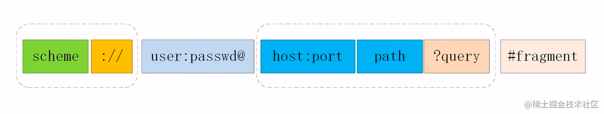

## 1. 什么是同源策略？什么是跨域？怎么解决跨域？
> 

> **同源策略**：_scheme(协议)_、_host(主机)_ 和 _port(端口)_ 都相同则为 _同源_ 

> **跨域**：当浏览器向目标URI发送AJAX请求，只要当前URL和目标URL不同源，则产生跨域，被称为跨域请求

> 跨域请求的响应一般是被浏览器拦截，响应已经成功到达客户端

> **解决跨域的方式**
> ### cors（跨域资源共享）
> * 简单请求
>  * 请求方法为GET，POST或者HEAD
>  * 请求头的取值范围：Accept、Accept-Language、Content-Language、Content-Type(只限于三个值 application/x-www-form-urlencoded、multipart/form-data、text/plain)
> * 非简单请求
>  * 非简单请求相对而言会有些不同，体现在两个方面: 预检请求和响应字段。 
> > 简单请求
> > 
> > 请求发出去之前会自动在请求头中添加一个 Origin 字段，用来说明请求来自哪个源。服务器拿到请求之后，在回应时自动的添加 Access-Control-Allow-Origin 字段，如果Origin不在Origin这个字段范围内，浏览器将会响应拦截
> >
> > 非简单请求
> >
> > 首先会发送预检请求，预检请求的方法是OPTIONS，同时会加上Origin源地址和Host目标地址，同时也会加上两个关键的字段:
> > * Access-control-allow-Methods: 列出 CORS 请求用到哪个HTTP方法
> > * Access-control-allow-Headers: 指定 CORS 请求将要加上什么请求头
> > 
> > 预检请求的响应
> >
> > `HTTP/1.1 200 OK`
> >
> > `Access-Control-Allow-Origin: *` 表示可以允许请求的源，可以填具体的源名，也可以填*表示允许任意源请求。
> >
> > `Access-Control-Allow-Methods: GET, POST, PUT` 表示允许的请求方法列表。
> >
> > `Access-Control-Allow-Headers: X-Custom-Header` 表示允许发送的请求头字段
> >
> > `Access-Control-Allow-Credentials: true` 表示是否允许发送 Cookie
> >
> > `Access-Control-Max-Age: 1728000` 预检请求的有效期，在此期间，不用发出另外一条预检请求。
> >
> > `Content-Type: text/html; charset=utf-8`
> >
> > `Content-Encoding: gzip`
> >
> > `Content-Length: 0 `
> >
> > 在预检请求响应返回后，如果请求不满足响应头条件，则触发XMLHttpRequest的onerror方法，当然后面真正的CORS请求也不会发出去了。
> > 
> > CORS请求就简单多了，跟简单请求的情况是一样的。
> ### Nginx 反向代理
> 客户端域名为 a.com, 服务端域名为 b.com 客户端向服务端发送ajax请求 必定跨域，这个时候就需要配置Nginx
> ```js
> server {
>   listen  80;
>   server_name  a.com;
>   location /api {
>   proxy_pass b.com;
>   }
> }
> ```
>  Nginx 相当于起了一个跳板机，这个跳板机的域名也是a.com，让客户端首先访问 a.com/api，这当然没有跨域，然后 Nginx 服务器作为反向代理，将请求转发给b.com，当响应返回时又将响应给到客户端，这就完成整个跨域请求的过程。

